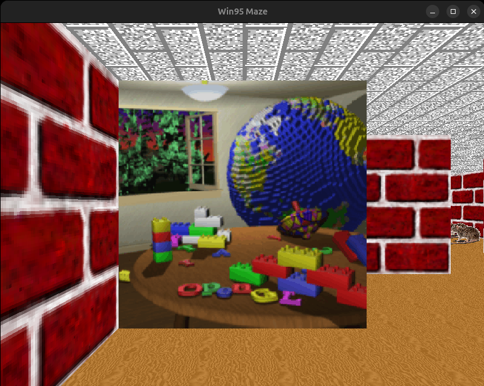

# mazescreensaver

Reimplementation of Windows95/98 OpenGL 3D Mazer using win95-maze-rs as base

This code was implemented with the help of Claude. Basically Claude was
able to convert https://github.com/clrnd/win95-maze-rs from Rust to C.

Since it is based on win95-maze-rs you need to follows its license (Apache 2.0)
